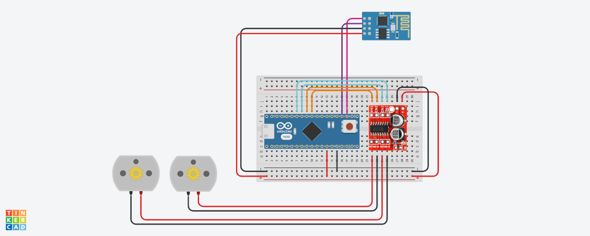

# Mini Robô Sumô - Arduino Day 2023 🤖🥊

Mini Robôs Sumô desenvolvidos para o evento <b>Arduino Day 2023</b> da ETEC Abdias do Nascimento 

> [Ig: @sumostrike.ds 🎥](https://www.instagram.com/sumostrike.ds/)

### Circuito Elaborado 🔌

### Componentes utilizados ⚙️
- 1 Arduino Nano
- 2 Motores DC com caixa de Redução
- 1 Driver Motor Ponte H
- 1 Módulo Bluetooth HC-05

### Modelos 3d 🖨️
- [Printable Sumo Bot Jr Kit by makenai](https://www.thingiverse.com/thing:357369)
- [Ikedo Kogeki Minisumo Robot Sumo Body by Joecarnine](https://www.thingiverse.com/thing:3911221)
