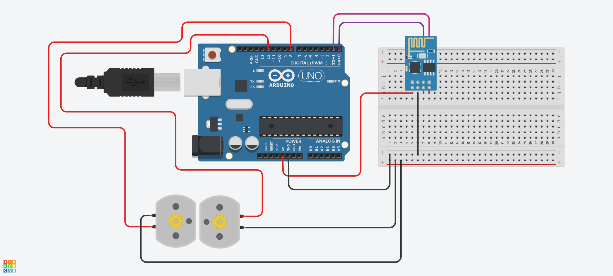

# Robô Sumô - Arduino Day 2023 🤖🥊

Robôs Sumô desenvolvidos para o evento <b>Arduino Day 2023</b> da ETEC Abdias do Nascimento 

> @sumostrike.ds 🎥

### Componentes utilizados ⚙️
→ 1 Arduino Nano

→ 2 motores

→ 1 Módulo Bluetooth HC-05

